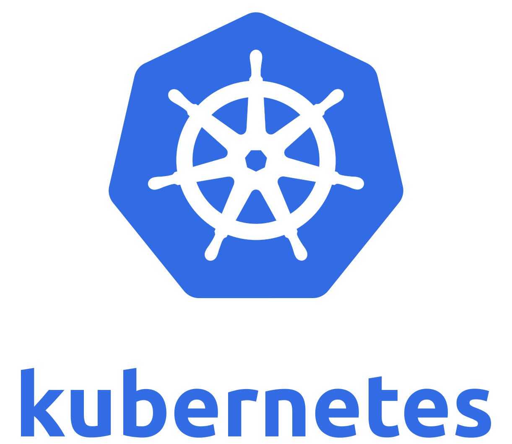

# Kubernetes

An Introductory Guide

---

**In the beginning there was Docker**
- Solves the "It works on my machine" problem
- Allows users to build and package and deploy applications
- Example: `docker run -p 80:80 nginx`
    - runs nginx binding to the host port **80**
---
### Docker Pitfalls
- When you have many applications you have to manage the toggles and deployment flags for each container
- 
