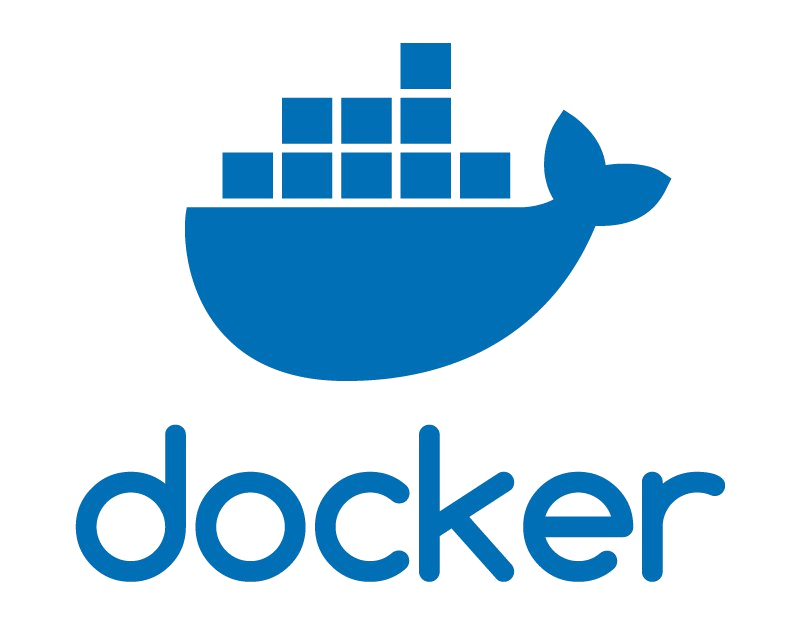

# Kubernetes

An Introductory Guide

Tim Britton

---

**In the beginning there was Docker**
- Solves the "It works on my machine" problem
- Allows users to build and package and deploy applications
- Example: `docker run -p 80:80 nginx`
    - runs nginx binding to the host port **80**
---
### Docker Challenges
- Managing Configuration is hard
- Managing the flags passed into the cli can be challenging
  * `docker run -v log_volume:/var/log -v data_volume:/var/data -v config_volume:/var/config -p 8080:8080 --link mysql image_name`
- You have to manage a fleet of vms runing docker
- You have to balance resource utilization yourself
---
### Docker Compose: Solving some of the problems
- Configurations are managed via yaml 
  * No longer need to manage cli flags
- Services spun up together can be easily linked
  * ie `depends_on: mysql`
  * Generates dns entries for the dependant services
- Still need to balance the load on the virtual machines yourself.
- Still need to manage configuration applications yourself
- Single Docker engine setup
---
### Notable Mention: Docker Swarm
- Container Orchestrator 
- Built on top of docker
- Allows you to convert from docker-compose without much pain
- Multi node
---
### Kubernetes: An Ecosystem for Orchestration
- Designed to be multi-node
  - Uses a pool of nodes and obscures it from the user 
- Handles load balancing
- Automated rollouts and rollbacks 
- Self healing
- Configuration Management
- Service Discovery
- Extensible 
---
# A Journey through k8s

---
### Pod: The smallest unit of measurement
- A pod is a wrapper around a container or a group of containers
- Each pod has a QoS associated to it that k8s will use to schedule the pod